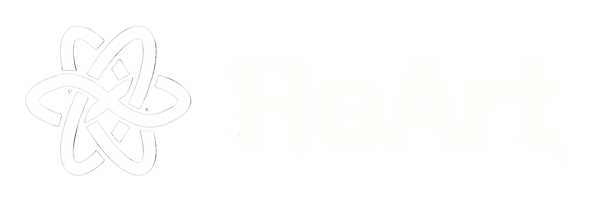

<div align="center">
	<br>
	
	<br>
	<b>Algorithmic art backgrounds for React — installed like shadcn/ui, owned by you.</b>
	<br>
  <sub>Stand out with 20+ free customizable backgrounds.</sub>
	<br>
	<br>
  <a href="https://www.npmjs.com/package/@dano796/react-reart"></a>
  <a href="https://github.com/dano796/reart/blob/main/LICENSE.md"></a>
  <br>
  <br>
</div>

## Table of Contents

- [What is ReArt?](#what-is-reart)
- [How it works](#how-it-works)
- [Requirements](#requirements)
- [Quick Start](#quick-start)
- [CLI Commands](#cli-commands)
- [Usage Example](#usage-example)
- [Contributing](#contributing)
- [License](#license)

## What is ReArt?

ReArt is an open source collection of animated canvas backgrounds for React. Each background is a self-contained renderer — you get the full source directly in your project with no runtime npm dependency.

## How it works

Inspired by [shadcn/ui](https://ui.shadcn.com/): instead of importing from a package, the CLI copies the component source files into your own project. You can read, edit, and extend them freely.

## Requirements

- React >=18.0.0

No other runtime dependencies. Components use only React and browser APIs (`canvas`, `requestAnimationFrame`, `ResizeObserver`).

## Quick Start

```bash
npx @dano796/react-reart add wave-ether
```

This copies the component files into `components/backgrounds/` in your project.

## CLI Commands

```bash
npx @dano796/react-reart list                       # Browse all available backgrounds
npx @dano796/react-reart info <id>                  # See files and description
npx @dano796/react-reart add <id>                   # Install a component
npx @dano796/react-reart add <id> --force           # Overwrite existing files
npx @dano796/react-reart add <id> --dry-run         # Preview which files would be written
npx @dano796/react-reart update <id>                # Re-fetch a component (with confirmation)
npx @dano796/react-reart add background-studio      # Install all components + the studio playground
```

## Usage Example

```tsx
import { WaveEther } from "./components/backgrounds/WaveEther";

export default function Hero() {
  return (
    <div style={{ position: "relative", height: "100vh" }}>
      <WaveEther style={{ position: "absolute", inset: 0 }} />
      <div style={{ position: "relative", zIndex: 1 }}>
        {/* your content */}
      </div>
    </div>
  );
}
```

Run `npx @dano796/react-reart info <id>` to see all available props for any component.

## Contributing

ReArt is always open to improvements and contributions. Check the [Open Issues](https://github.com/dano796/reart/issues) if you want to contribute, or open a new one to add your own improvements/ideas. Before contributing, please read the [Contribution Guide](./CONTRIBUTING.md).

## License

[MIT + Commons Clause](./LICENSE.md)
